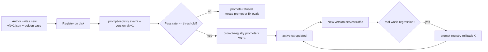

# Prompt registry kit

[](https://github.com/derekgallardo01/prompt-registry-kit/actions/workflows/ci.yml) [](LICENSE) [](#) [](https://codespaces.new/derekgallardo01/prompt-registry-kit)

**Docs:** [Getting started](docs/getting-started.md) · [Architecture](docs/architecture.md) · [Customization](docs/customization.md) · [Evaluation](docs/evaluation.md) · [Diagrams](docs/diagrams.md) · [FAQ](docs/faq.md)

**Live demo:** [derekgallardo01.github.io/prompt-registry-kit](https://derekgallardo01.github.io/prompt-registry-kit/) — three bundled prompts with two versions each, with per-version eval pass rates and promotion hints, regenerated on every push.

Versioned prompt registry with A/B variants, eval-gated promotion, and
instant rollback. The production-ops piece every LLM build needs once
**"we changed the prompt"** becomes the most common root cause of
outages.

Default LLM backend is a deterministic stub so the kit runs anywhere
without keys. The seam is one method (`Runner._call_claude`); set
`PROMPT_REGISTRY_LLM=claude` to route through Claude.

```bash
pip install -e .
prompt-registry list                          # show all prompts + active versions
prompt-registry show customer_complaint_classifier
prompt-registry eval customer_complaint_classifier --version v2
prompt-registry promote customer_complaint_classifier v2      # gated on eval pass
prompt-registry rollback customer_complaint_classifier
```

```bash
python -m pytest -q   # 36 unit tests
prompt-registry demo  # all 3 prompts × all versions × eval reports
```

Stdlib-only Python on the default path. `anthropic` is an optional extra.

## Run in Docker

```bash
docker build -t prompt-registry .
docker run --rm prompt-registry                  # runs `prompt-registry demo`
docker run --rm prompt-registry pytest -q        # runs the tests
docker run --rm -v $(pwd)/registry:/app/registry prompt-registry prompt-registry list
```

## What it's for

The team has 30 LLM features in production. Each one has a prompt. Each
prompt is iterated weekly. Someone tweaks the customer-complaint
classifier — adds a couple of words to the system message — and 12
hours later support is paging because everything's classified as
`general` now.

You can't reproduce it. You can't see what the prompt USED to be. You
can't tell if the regression is in the prompt or the model. There's no
"undo." There's no eval that would have caught this before deploy.

This kit is what stops that loop:

- **Versioned, immutable prompts** — every change is a new version file
  on disk. Git history + diff just works.
- **A/B variants** — multiple versions of the same prompt can coexist
  in the registry. One is `active`; others are experiments.
- **Golden eval cases per prompt** — `golden.json` next to the version
  files. Each case asserts the response against a rubric (in_set,
  exact_match, contains_all, contains_any, matches_regex).
- **Eval-gated promotion** — `prompt-registry promote X v2` runs the
  eval suite first and refuses to flip `active` if the pass rate is
  below threshold. Override with `--force` if you mean it.
- **Instant rollback** — `prompt-registry rollback X` reverts to the
  previous active version with no rebuild.
- **Pluggable LLM backend** — stub by default (deterministic, free, in
  CI); Claude swap via one env var.

## Layout

```
registry/
    customer_complaint_classifier/
        v1.json          # immutable - never edit
        v2.json          # immutable - never edit
        golden.json      # gold-labelled cases (shared across versions)
        active.txt       # one line: which version is serving traffic
    meeting_recap/
        v1.json, v2.json, golden.json, active.txt
    policy_summary/
        v1.json, v2.json, golden.json, active.txt
```

To change a prompt: write a new `vN+1.json`. Existing versions are
immutable, so existing eval results stay reproducible.

## Bundled prompts

| Prompt | What it does | Versions |
|---|---|---|
| `customer_complaint_classifier` | Classifies customer messages into refund_request / service_issue / billing_dispute / general | v1 open-ended; v2 adds per-class definitions |
| `policy_summary` | One-sentence summary of a policy doc | v1 open-ended; v2 adds an Action: suffix |
| `meeting_recap` | Three-section meeting recap (Summary/Decisions/Action items) | v1 free-form; v2 enforces `[Owner]` prefix on action items |

Each version pair shows a typical **prompt iteration**: stricter
contract in v2 that the golden cases verify.

## End-to-end demo

```bash
$ prompt-registry list
  customer_complaint_classifier        active=v1  latest=v2 (drift)
  meeting_recap                        active=v1  latest=v2 (drift)
  policy_summary                       active=v1  latest=v2 (drift)

$ prompt-registry eval customer_complaint_classifier --version v2
  PASS  refund-explicit
  PASS  refund-keyword
  PASS  service-down
  PASS  service-broken
  PASS  billing-charge
  PASS  general-feedback
  PASS  general-question
  7/7 passed (100%)

$ prompt-registry promote customer_complaint_classifier v2
  Eval passed: 7/7 (100%)
  Promoted 'customer_complaint_classifier' to v2 (was v1).

$ prompt-registry rollback customer_complaint_classifier
  Rolled back 'customer_complaint_classifier' to v1.
```

## The backend seam

```python
# src/prompt_registry/runner.py
def _call_stub(self, version, rendered, vars): ...      # deterministic
def _call_claude(self, version, rendered):              # production
    # client.messages.create(model=version.model, ...) → response
```

Both return strings. The eval + promote + rollback flow doesn't know
which backend produced the response — it just scores it against the
rubric.

`_call_claude` ships as a documented sketch. Wire it once for your
deployment; the stub keeps tests + Pages demo green meanwhile.

## Architecture



## What's inside

| Path | Purpose |
|---|---|
| `src/prompt_registry/registry.py` | File-backed registry (read/write/promote/rollback) |
| `src/prompt_registry/runner.py` | Backend dispatch + deterministic stub + Claude seam |
| `src/prompt_registry/evaluator.py` | Rubric scoring + per-version reports |
| `src/prompt_registry/cli.py` | CLI: list/show/run/eval/promote/rollback/demo |
| `registry/<prompt>/v*.json` | Versioned prompts (immutable once written) |
| `registry/<prompt>/golden.json` | Eval cases per prompt |
| `registry/<prompt>/active.txt` | One line: currently-active version |
| `tests/` | 36 pytest tests across registry + runner + evaluator |
| `pyproject.toml` | Package + `prompt-registry` script entry |

## Companion repos

- [claude-agent-sdk-example](https://github.com/derekgallardo01/claude-agent-sdk-example) — uses prompts via the Claude Agent SDK; in production you'd source those prompts from this registry.
- [m365-agents-sdk-example](https://github.com/derekgallardo01/m365-agents-sdk-example) — same story for Microsoft 365 Agents SDK builds.
- [document-classifier-kit](https://github.com/derekgallardo01/document-classifier-kit) — the `customer_complaint_classifier` bundled here is the LLM-backed twin of the rules-based classifier in that kit.
- [rag-over-docs-kit](https://github.com/derekgallardo01/rag-over-docs-kit) — the RAG kit's system prompts are exactly the kind of thing this registry is for.
