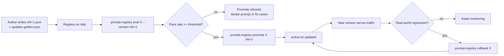
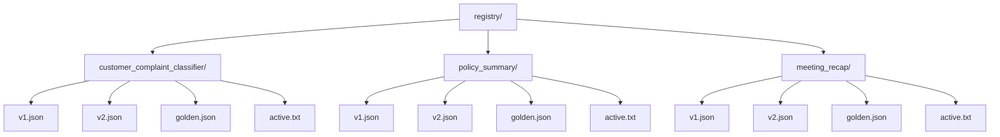
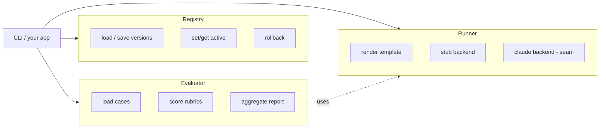
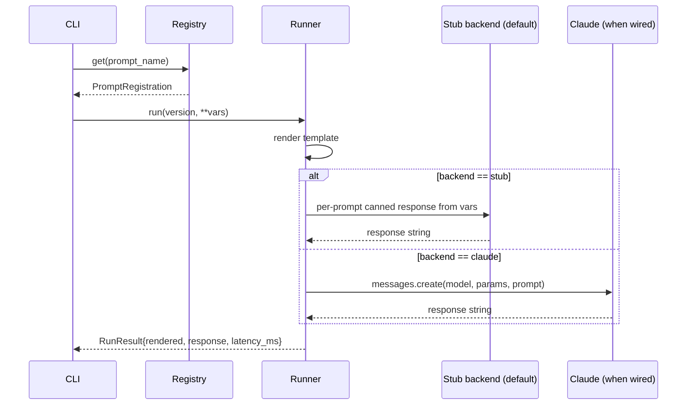
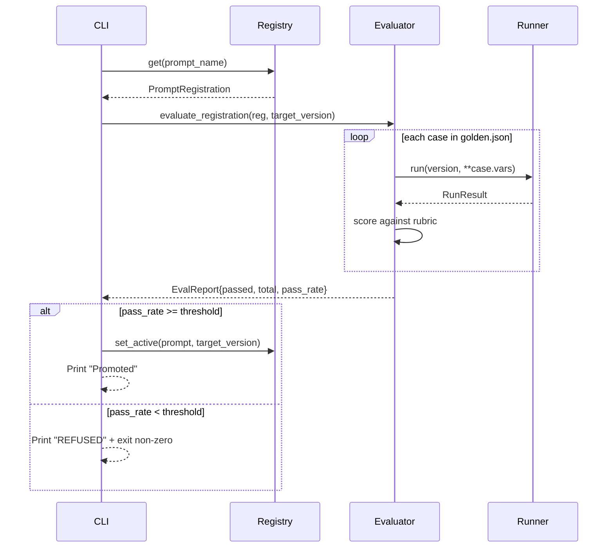
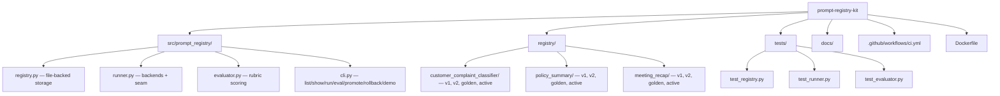

# Diagrams

GitHub renders Mermaid natively. These render on the README and in this file.

## Author → eval → promote → rollback

## On-disk layout

Each version file is immutable. To change a prompt, write a new
version. `active.txt` is the only mutable file per prompt.

## Three components, explicit boundaries

The CLI is the glue. Each component is independently testable. The
runner knows nothing about evals; the evaluator knows nothing about
file paths; the registry knows nothing about LLMs.

## A prompt run

## The promote gate

## Repo shape

